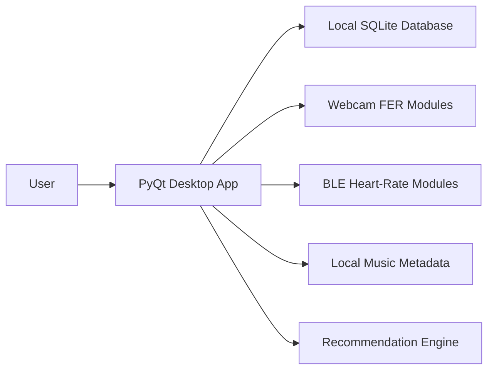
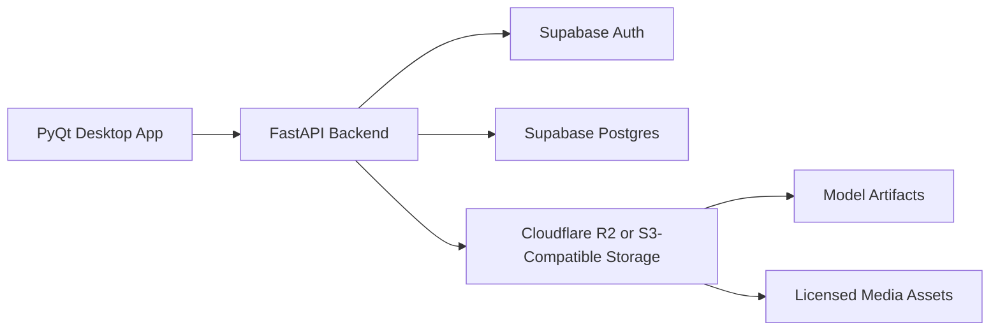

# MyRhythm Architecture

## Current Public Baseline

MyRhythm is kept local-first for the public baseline.

The desktop app owns the UI, local authentication prototype, local SQLite cache, webcam and BLE device access, local playback, and offline recommendation behavior.

## Future Cloud Boundary

Cloud work should be added only after the sanitized desktop app is stable.

The backend should own auth token verification, user profile and preference APIs, music catalog metadata, recommendation APIs for cloud catalog data, model manifests, and signed object URLs.

The desktop app must not contain object-storage secrets, raw cloud database credentials, service-role keys, or upload permissions.

## Candidate Cloud Tables

- `profiles`
- `user_preferences`
- `songs`
- `audio_features`
- `model_artifacts`
- `recommendation_runs`
- `recommendation_items`
- `emotion_events` for optional label/confidence records only

Raw webcam frames, face images, raw heart-rate streams, and emotion logs should remain local by default.
