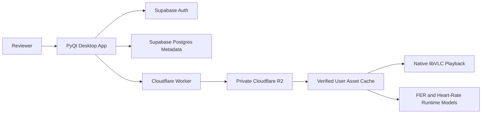

# MyRhythm Architecture

## Signed-In Reviewer Runtime

Supabase is the source of truth for reviewer identity, preferences, song
metadata, asset object keys, checksums, and model manifests. Cloudflare R2
stores private binary assets. The Worker validates Supabase sessions,
authorizes object metadata, rate-limits requests, and streams R2 objects.

The signed-in runtime does not initialize or query SQLite. Local SQLAlchemy
modules and sample-ingestion scripts remain for offline development only.

## Client Security Boundary

The desktop app contains only public client configuration. It never contains
R2 credentials, a Supabase service-role key, a database password, or a
Cloudflare API token. Raw webcam frames and raw heart-rate streams remain local
by default.
